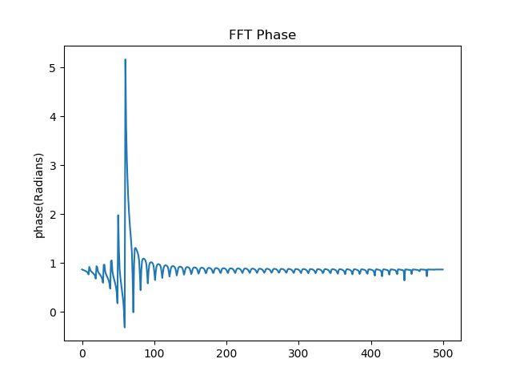

# Precise Filter Design - FDLS Technique from Greg Berchin
This is an implementation in Python of the FDLS technique described in chapter 7 of the book Streamlining Digital Signal Processing 2th Ed.   

## Description
This is a simple implementation in Python of the FDLS (Frequency Domain Least Squares) technique described in chapter 7 of the book Streamlining Digital Signal Processing 2th Ed. . The same technique was also described in the Master thesis of the author of the technique, Greg Berchin. <br>
The technique is a method of filter construction. By starting from the specification of the frequency response that we requirer (attenuation and phase-shift by frequency plots), we can design a FIR or a IIR filter that is in principal more precise that the normally designed FIR or IIR filter and it doesn't need to be a linear phase filter like the normal FIR designs. <br>
This technique has many different applications, but the author gives the following example ... Imagine that you were an Electrical Engineer given the task of replacing an analog filter circuit or section with digital filter. With this technique you could start by testing and characterizing the analog circuit, obtain the frequency response of the analog circuit, it's attenuation with frequency and it's phase-shift with frequency and then using the technique, design a FIR or a IIR digital filter that would replace the original analog circuit. 
Note: See the book for more details. <br>

## Equations and steps of the method

```
###########
# Equations

 =>Filter in polynomial form:

     Y(Z)    b_0 + b_1*Z^-1 + ...... + b_n*Z^-N
     ---- = ------------------------------------            (1)
     U(Z)      1 + a_1*Z^-1 + ...... + a_d*Z^-D

 
 =>Matrix system that we want to solve:

    Y = X * THETA                                           (2)

 
 =>To fill the Y column vector of equation (2):
 
        ---              --- 
        | A_1 * cos(phi_1) |
    Y = | A_2 * cos(phi_2) |                                (3)
        |      ......      |
        | A_m * cos(phi_m) |
        ---              ---


=>To fill de X matrix of equation (2):

                                                                     ---   ---
 ---      ---   ---                                              --- |  a_1  |
 | y_1( 0 ) |   | -y_1( -1 ) ... -y_1( -D ) u_1( 0 ) ... u_1( -N ) | |  ...  |
 | y_2( 0 ) |   | -y_2( -1 ) ... -y_2( -D ) u_2( 0 ) ... u_2( -N ) | |  ...  |
 |   ...    | = |   ...            ...        ...         ...      | |  a_D  |    (4)
 |   ...    |   |   ...            ...        ...         ...      | |  b_0  | 
 | y_M( 0 ) |   | -y_M( -1 ) ... -y_M( -D ) u_M( 0 ) ... u_M( -N ) | |  ...  |
 ---      ---   ---                                              --- |  ...  |
                                                                     |  b_N  |
                                                                     ---   ---

 =>How to fill one line of matrix X, for the case that D = 2 and N = 2.

   Starting with:

     -y_1( -1 ) ... -y_1( -D ) u_1( 0 ) ... u_1( -N )                    (5)

   it becomes:

     -y_1( -1 ) -y_1( -2 ) u_1( 0 ) u_1( -1 ) u_1( -2 )                  (6)

   and that then becomes:

     -y_1( -1 ) = A_1 * cos((-1)*W_1*T_s + phi_1) = -A_1 * cos(-W_1*T_s + phi_1)

     -y_1( -2 ) = A_1 * cos((-2)*W_2*T_s + phi_2) = -A_1 * cos(-W_2*T_s + phi_2)

      u_1( 0 ) = cos((0)*W_1*T_s) = cos(0*w_1*T_s) = 1                           (7 as an all)

      u_1( -1 ) = cos((-1)*W_1*T_s) = cos(-W_1*T_s)

      u_1( -2 ) = cos((-2)*W_1*T_s) = cos(-2*W_1*T_s)


 =>don't forget that:

      w_M = 2*PI*freq_M                                   (8) 

   in witch the M is the max number of data points but in here
   corresponds to one data point of the M possible, 
   that is the frequency of one data point in the CSV table.


 =>And have in mind that T_s is the period of
   the sample_rate of the signal, that is:

   for a sample_rate = 1000 samples / second  it will be
    
     T_s = 1 / sample_rate                                (9)
   
   that is T_s = 0.001 = 10^-3 seconds 


 =>Pseudo-Inverse calculation to obtain the column vector THETA of equation (2),
   this vector will have the two types of coefficients for the filter:

    THETA ≈ Inverse(Transpose(X) * X) * Transpose(X) * Y        (10)


```

0. Read configuration file with filter program parameters. It's a CSV.

1. Start with a file containing the frequency response that we would like that our filter to have. This CSV file should have many data points. The CSV file has the following structure: <br>
frequency, amplitude (in linear scale), phase (in radians) <br>
An interpolation function could be optionally added to generate more intermediate points. <br>
In here, we will have to choose the M, the number of data points (tuple) that we will be using. The M will dictate the number of rows of the matrix X.

2. Choose the N=? and D=? values. The N is the degree of the polynomial in the numerator and the D is the degree of the polynomial in the denominator of equation (1). Only one N or D can be zero at the same time, but they can be a zero or a positive number of any value. The greater the N and D number, the larger the filter will be that we are constructing and the more demanding in terms of computational cost it will be to run it.

3. Choose the sample_rate of the digital signal to choose the T_s, that is the period of the sample rate that is calculated with equation (9).

4. Fill the y_m sequence of cosines for the length of D.

5. Fill the u_m sequence of cosines for the length of N+1 (Note: In here is plus one terms).

6. Join the columns of y_m concatenated with u_m to make the matrix X of matrix equation X (2).

7. Create the column vector Y of equation (3).

8. Calculate the Pseudo-Inverse the vector THETA. It will have the filter coefficients. Depending on the number chosen for N and D, a different type of filter topology will be made.

9. Generate the filter in Python and the C programming language, ".H" source code of the filter file with the name "custom_filter.h".

10. Test the filter frequency response with a chirp signal, a N sinusoidals signal, and a noise signal between frequency A and frequency Bl between the frequency limits. 


## User manual

* Configure the ./input_freq_response/config.csv file. <br>
  Parameters from config.csv file:<br>
     * **filepath_freq_response** = .\\\\input_freq_response\\\\<br>
     * **filename_freq_response** = freq_response_book.csv <br>
     * **factor_num_of_interpolated_points** = 10 <br>
     * **flag_interpolated** = False <br>
     * **N_val** = 2   (Note: The **degree of the polynomial numerator** of the transfer function of the filter.)<br>
     * **D_val** = 2   (Note: The **degree of the polynomial denominator** of the transfer function of the filter.)<br>
     * **sample_rate** = 1000 <br>

* Specify the frequency response file (./input_freq_response/freq_response.csv) configured in the previous file for each frequency (linear amplitude and phase shift). <br>
  The file has the following structure: <br>
  **frequency, amplitude (in linear scale), phase (in radians)** 

* Run the program...


```

python precise_filter_design.py 

```  

* Change the signal test function, by uncommenting the plot's and comment the plot's that you don't want test. And run the program again. Then study the generated plot's.    

## Output images

Note: The input signal is before applying the filter and the output signal is after applying the filter. <br> <br>

Book frequency response to N sinusoids of input signal in the time domain - 1 <br>
 <br>

Book frequency response to N sinusoids of input signal in the frequency domain spectrum - 2 <br>
 <br>

Book frequency response to N sinusoids of input signal in the frequency domain phase-shift - 3 <br>
 <br>

Book frequency response to N sinusoids of output signal in the time domain - 4 <br>
 <br>

Book frequency response to N sinusoids of output signal in the frequency domain spectrum - 5 (Note: Input signal doesn't have constant amplitude) <br>
 <br>

This one is the result of a different test signal of noise in all range with constant amplitude but random phase. So one can see better the attenuation response of the filter. <br>
 <br>

Book frequency response to N sinusoids of output signal in the frequency domain phase - 6 <br>
<br>

## Glossary
FIR filter - Finite Impulse Response filter 
IIR filter - Infinite Impulse Response filter

## References
* Book - Streamlining Digital Signal Processing 2th Ed.
  Edited by Richard G. Lyons

**You can also see:** <br>

* G. Berchin, "A new algorithm for system identification from frequency response information" Master's Thesis, University of California-Davis, 1988

* G Berchin and M. Soderstrand, "A transform-domain least-squares beamforming technique" Proceedings of the IEEE Oceans '90 conference', Arlington VA, Setember 1990

* G. Berchin a nd M. Soderstand, "A total least squares approach to frequency domain system identification" Proceedings of the 32nd Midwest Symposium on Circuits and Systems, Urbana IL, August 1989  

## License
MIT Open Source license.

## Have fun!
Best regards, <br>
Joao Nuno Carvalho 